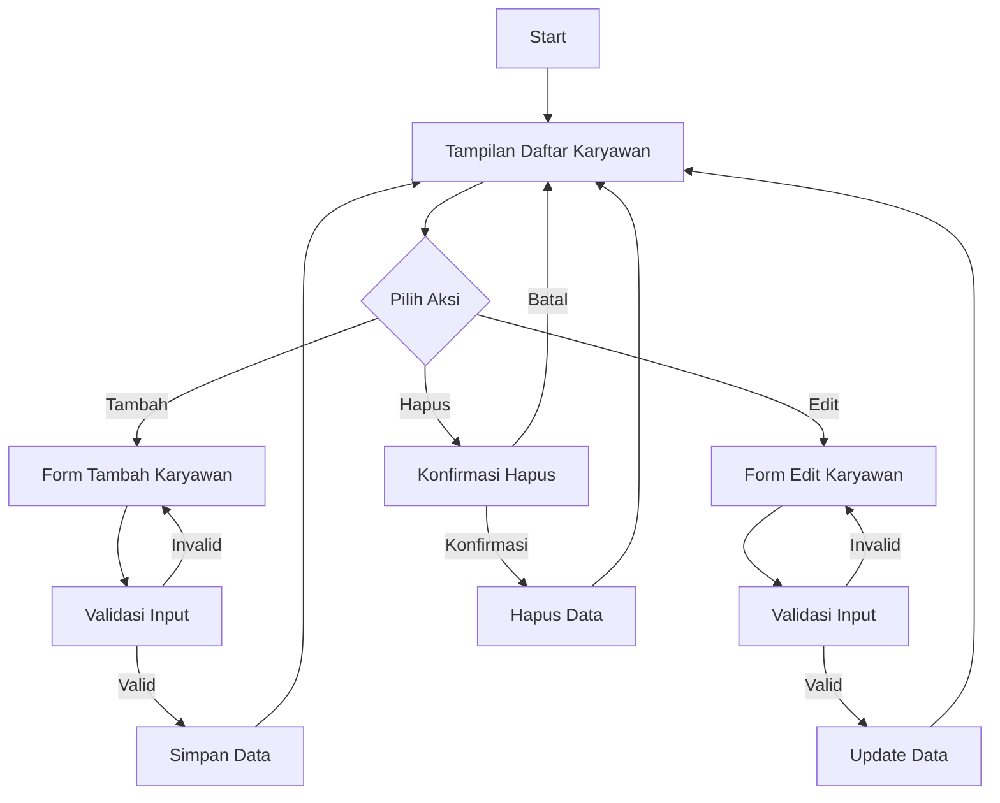
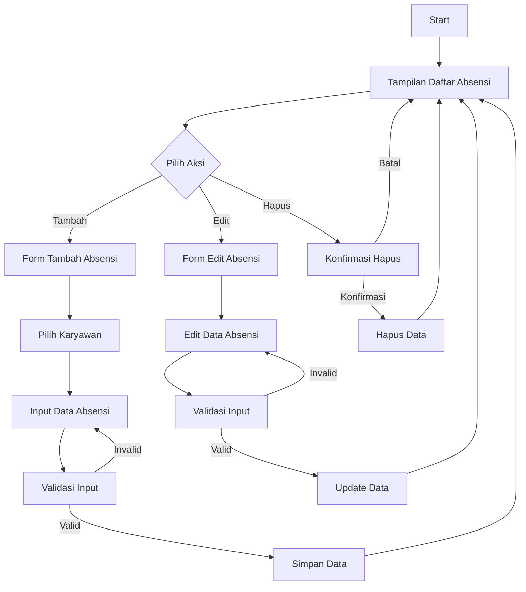

# Entity Relationship Diagram (ERD) dan Flowchart Sistem Absensi Karyawan

## Entity Relationship Diagram (ERD)

```dbml
// Use DBML to define the database structure
// Docs: https://dbml.dbdiagram.io/docs

Table karyawan {
  id integer [primary key]
  nama varchar [not null]
  nik varchar [unique, not null]
  jabatan varchar [not null]
  alamat text [not null]
  created_at timestamp
  updated_at timestamp
}

Table absensi {
  id integer [primary key]
  karyawan_id integer [not null, ref: > karyawan.id]
  tanggal date [not null]
  status enum [note: 'hadir, izin, sakit, alpha']
  keterangan text
  created_at timestamp
  updated_at timestamp
}

// Relationships
Ref: absensi.karyawan_id > karyawan.id // many-to-one
```

### Penjelasan ERD:
1. Entitas KARYAWAN:
   - Memiliki primary key `id`
   - Memiliki atribut `nama`, `nik` (unique), `jabatan`, dan `alamat`
   - `created_at` dan `updated_at` untuk tracking waktu
   - Satu karyawan dapat memiliki banyak absensi (one-to-many)

2. Entitas ABSENSI:
   - Memiliki primary key `id`
   - Memiliki foreign key `karyawan_id` yang merujuk ke tabel KARYAWAN
   - Memiliki atribut `tanggal`, `status` (enum: hadir, izin, sakit, alpha), dan `keterangan`
   - `created_at` dan `updated_at` untuk tracking waktu

## Flowchart Sistem

### 1. Flowchart Manajemen Karyawan



### 2. Flowchart Manajemen Absensi



### Penjelasan Flowchart:

1. **Manajemen Karyawan**:
   - Sistem menampilkan daftar karyawan
   - User dapat memilih untuk menambah, mengedit, atau menghapus karyawan
   - Setiap aksi memiliki validasi input
   - Setelah aksi selesai, kembali ke daftar karyawan

2. **Manajemen Absensi**:
   - Sistem menampilkan daftar absensi
   - User dapat memilih untuk menambah, mengedit, atau menghapus absensi
   - Saat menambah/edit absensi, user harus memilih karyawan
   - Validasi input untuk memastikan data valid
   - Setelah aksi selesai, kembali ke daftar absensi